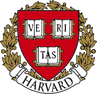
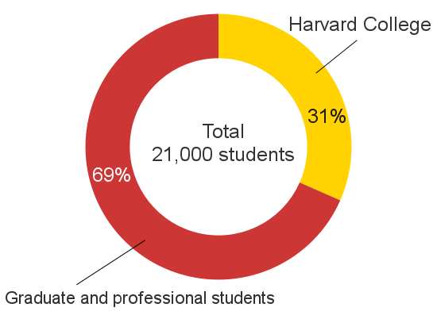
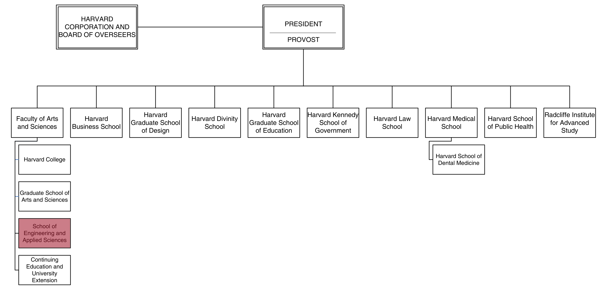
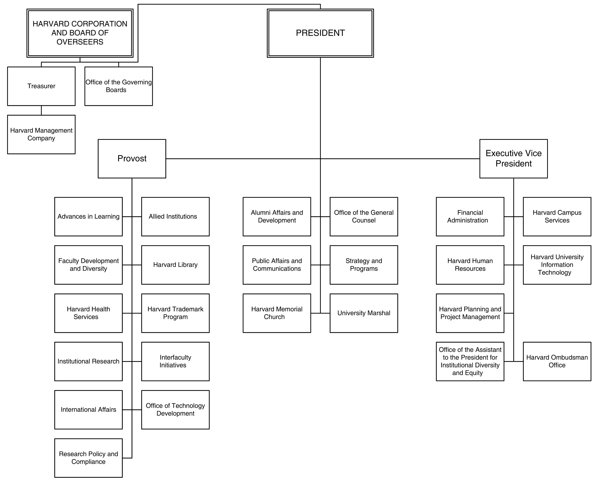

---
authors:
- Thibaut Vercueil
date: summer 2015
...

This is the abstract

Acknowledgement {#acknowledgement .unnumbered}
===============

Introduction
============

History
=======

Harvard University
------------------

R0.2 

Harvard university is the most ancient university of the United States.
It’s located in Cambridge, Massachusetts, in Boston’s suburb. It has
been created in 1636 by vote of the Court of the Massachusetts Bay
Colony. The school was name *Harvard College* in 1639, in homage to John
Harvard, who had left the school livre 779 and his library of some 400
books. John Harvard was the first donor to the school.\
During the following decades, Harvard University never ceased to grow up
and it’s now the richest University in the world with \$36.4 billion of
endowment.

Harvard university include several universities, here is a list of the
most important ones:\

-   Faculty of Arts and Sciences composed by\
    Harvard College\
    Continuing Education\
    Graduate School of Arts and Sciences\
    Harvard John A. Paulson School of Engineering and Applied Sciences

-   Business School

-   Kennedy School of Government

-   Law School

-   Medical School

-   Radcliffe Institute

-   School of Education

-   Harvard T.H. Chan School of Public Health

Harvard School of Engineering and Applied Sciences
--------------------------------------------------

As you saw earlier “beeing in Harvard” without precising which
university doesn’t mean much, and so, during this in internship, I was
affiliated to the Harvard School of Engineering and Applied Sciences,
later called SEAS — Litte story: the school name changed during my
journey, as Mr John A. Pauson did a donnation of \$ 400.000.000 to SEAS,
so the school was rename after him.\

The progenitor of the School of Engineering and Applied Sciences was
called *Lawrence Scientific School* and was founded in 1847. It was name
for Abbott Lawrence, who donated \$50,000 (an unprecedented sum at the
time) to create the institution. The was detached from Harvard College,
which means it was independ financiery. At this time, the School saw a
diverse group of thinkers and professionals — astronomers, architects,
naturalists, engineers, mathematicians, and even philosophers — pass
through its doors.\
At the end of the 19^th^ century, the school suffered the “Competition”
from the new born Massachusset Institute of Technology (MIT) — Now one
of the greatest engineering school in the world. The Harvard president
of the time tried to merge the Harvard Scientific School with the MIT,
vainly.\
In 1901, despite the help of Gordon McKay, the school merged with
Harvard College and lost his independance.\

Later, the Harvard Lawrence Scientific School became *The Division of
Applied Science* and in 2007, it was rename as the *Harvard School of
Engineering and Applied Science*\
It’s a new start for the the School, Venkatesh Narayanamurti, Dean of
Harvard School of Engineering and Applied Sciences at the time
declared:\
\

Thus, strictly speaking, SEAS is a young school, only 8 years old, and
in full growth. Thanks to the 4 milion dollars given by John Paulson,
the school will expend and build laboratories in Allston, the city
bordering Cambrigdge, on the other side of the river.\

In order to realise the importance of Harvard engineering school in the
world of sciences, here are a few examples of inventions made here:

-   in 1919, the **crystal oscillator** came out of the Harvard
    Engineering School’s Cruft Laboratory, invented by George Washington
    Pierce

-   in 1938, the **largest cyclotron of the world** (at the time) was
    constructed at the Graduate School of Engineering’s Gordon McKay
    Engineering Laboratory.

-   in 1977, Bill gates would have graduated from Harvard but he left
    the university to found **Microsoft**, one of the biggest company in
    the world.

-   in 2004, **Facebook** was born in a dorm room of Harvard housing,
    created by Mark Zuckerberg, it’s now the biggest social network ever
    created

Mazur group
-----------

Harvard School of Engineering and Applied Sciences is composed by
several reseach groups. This summer, I worked with the group of
professor Eric Mazur, Balkanski Professor of Physics and Applied Physics
and Area Dean for Applied Physics.\
Professor Mazur founded the group in 1111to study the dynamics of
molecules, chemical reactions, and condensed matter on very short
timescales — down to femtoseconds ($10^{-15}$ second). Physics in this
ultrafast regime is studied using light, specifically very short laser
pulses. So the mazur group works with femtoseconds lasers.\
In addition to the work in optical physics, The Mazur Group is very
active in research about education. In 1990, Eric Mazur began developing
Peer Instruction, a method for teaching large lecture classes
interactively. He is the author of *Peer Instruction: A User’s Manual*
(Prentice Hall, 1997), a book that explains how to teach large lecture
classes interactively.

Organization
============

Main organization of the university
-----------------------------------

Harvard University is huge. It’s composed by a dozen of universities and
it’s under the direction of the president Drew Gilpin Faust and the
provost Alan M. Garber.\

Harvard is known to be a decentralized organization. Each constituent
faculties has a lot of independence. This mean each faculties set their
own academic standards and manage their own budgets. Each facultie is
directed by the faculty dean whose role is to manage the matters of the
facutly\

Here you can see a chart representing the several faculties composing
Harvard University (The one in which I worked is highlighted):\

However, despite this decentralized management, the roles of the
president and the provost are really important.\

**The president** of Harvard university has two hats: Chief
administrator of the university and the *ex officio* chairman of the
Harvard Corporation. The president plays an important part in
university-wide planning and strategy. She names a faculty’s dean the
university’s provost, and she grants tenure to recommended professors.
However, she is expected to make such decisions after extensive
consultation with faculty members.\
Moreover, as the leader of one of the most prominent universities in the
world, Harvard presidents have influenced educational practices
nationwide.\

**The provost** of Harvard serves as chief academic officer. He works
with the President to oversee academic policies and activities
university-wide. The Office of the Provost works closely with the
University’s academic and administrative leaders to: foster interfaculty
collaboration, improve Harvard’s performance in building a diverse
pipeline of scholars and in developing scholars at all stages of the
academic career ladder, advance university-wide approaches to compliance
and research policy, support University cultural and artistic entities
and projects; oversee and coordinate the University’s international
activities; support faculty, students, and academic professionals in
advancing innovations in teaching and learning; and oversee activities
pertaining to intellectual property, technology transfer, research
collaborations with industry, and trademark licensing[^1].\
The chart bellow represent the organization of the Harvard’s central
administration:\

Main organization of Harvard School of Engineering and Applied Sciences
-----------------------------------------------------------------------

As I said earlier, each faculty composing Harvard university is very
independent. As a consequence, School of Engineering and Applied
Sciences has it’s own intern administration and financial management.\
At the head of SEAS, we have the Dean, Francis J. Doyle III His role is
to manage new faculty recruitment and faculty relations, for example
authorizing faculty searches, approving promotion reviews ans special
appointments. Furthermore, he leads strategic planning for SEAS (mostly
the financial needs) and he coordinates fundraising. He organizes the
alumni relations, which are very important in a university such as
Harvard.\

The facutly is diveded into 8 “areas”, at the head of which are the
**area deans**.\
Each area dean is helped in his work by the **area director**

Mission and goals
=================

In the internship offer, my mission was described as following:\

*We will update the Mazur group website. We need a student to port the
php/mysql based Mazur group website to a new content management system
and update photos and content. Skills needed: php/mysql experience
required experience with some content management platform (WordPress,
drupal, etc.) preferred. Bonus points for Adobe suite or CSS template
coding.*\

I went on to see the website and I saw that it needed a wind of change.
The design looks old and it doesn’t fit to the screen, and the websites
contains some dead links and not working search bars.\
I was not sure yet about How will I work and I waited to see my mentor
Daryl to have more infomation about the mission.\

So, in my first day of internship, I met Daryl, a post-graduate student
who work with the Mazur group, and she told me that a designer will take
care of the **front-end ** part. I was pretty happy with this news,
since I don’t master web design and it’s not the part of web
developpement I’m intersted in. Consequently, my job was to develop the
**back-end** part of the website, i.e the PHP/SQL code which drives the
core of the content management website.\
Later, about a week after I started my internship, I met Eric Mazur,
principal investigator of the group, he gave me his specifications.

Specifications
--------------

Basically the goal of my mission was to create a new website for the
Mazur group, whith pretty much the same features as the old one which
are in a nutshell:

-   For the visitor: Navigate through the contents (Publications, Talks,
    People, News about the group)

-   Be able to search overall the website

-   For the members of the group: Add, update and delete content.

Difficulties encoutered
-----------------------

### Languages and technologies {#languages-and-technologies .unnumbered}

When I started to work on the website, my first task was to download the
old website and database on my computer so I could work locally without
“damaging” the current website.\

I discovered that the database management system was **PostgreSQL**. I
have always worked with **MySQL** as a management system and so I wasn’t
familliar at all with Postgre.\
So, one of my first task during this internship was to install a
PotgreSQL server on my computer which runs on ubuntu, simply by
executing\
`# sudo apt-get install postgresql`\
 in the terminal.\
Then, once I had installed the server locally, I nedded to import the
current database and learn how to use Posgresql. I used a lot the
documentation on PostgreSQL offical website[^2] which is really
complete.\

For a little while, I navigated through the database using command line,
but it wasn’t practical at all. Thus, I looked for a graphical user
interface administration tool for managing the database, an equivalent
of phpMyAdmin but for PostgreSQL, which would help me to manage the
database.\
I chose to install *PgAdminIII*, a powerful tool that allows me to
manage the database, see the tables, execute queries…

In conclusion, learning how to use PostgreSQL wasn’t so hard but it took
me about a whole week to be really used to it. The query syntax is SQL
so it wasn’t different from I learnt at school.

### Database {#database .unnumbered}

Once I mastered PostgreSQL and database management, I started to look at
the current database organization of the website. The fist thing I
noticed was that it was very disordered. The database contained 196
tables where about a hundred was empty. Moreover, the encoding of the
data was ASCII, a very old encoding format which can represent only 128
characters.\
Thus, the first thing I did with the database was to convert it into
UTF-8 encoding, a modern character encoding system, compatible with
ASCII and way more complete.\
Thanks to that, special characters such as “é” or “ï” can now be used in
the database.\

After looking at all the tables in the database, I decided to create a
new one, and import tables that I wanted in it, so that this database
would be “cleaner”. In order to easily transfer tables from a database
to the other, I wrote a shell script which automatize the process:\

~~~~ {.bash language="bash"}
#!/bin/bash
#Transfers tables from old database to new one
pg_dump -h localhost -U mazur_www mazur_www_utf8 --table $1 > /tmp/$1.pgsql #Exporting
psql -h localhost -U mazur_www mazur_db < /tmp/$1.pgsql #Importing
rm /tmp/$1.pgsql #Cleaning
~~~~

### Independance {#independance .unnumbered}

During this internship, I had a really great independance. I worked
mostly with the IT-Team of Harvard School of Engineering and Applied
Sciences so I could ask them if had questions, but my internship master
wasn’t there most of the time.

Work organization
=================

Tools
-----

Skills used
===========

Results
=======

[^1]: provost.harvard.edu

[^2]: www.postgresql.org
